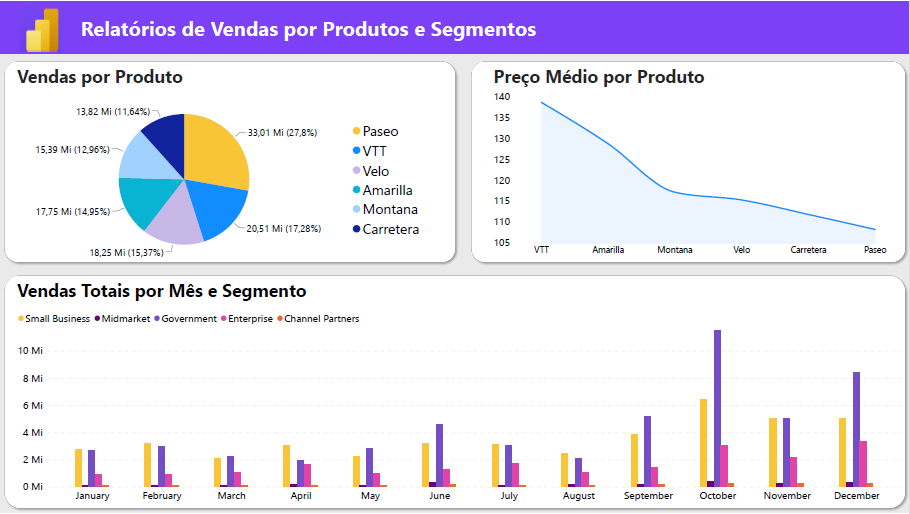
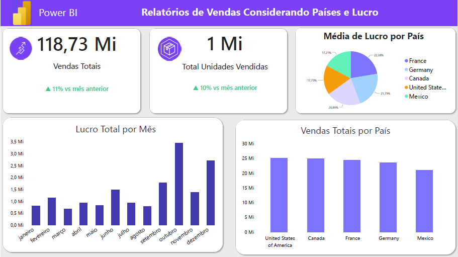
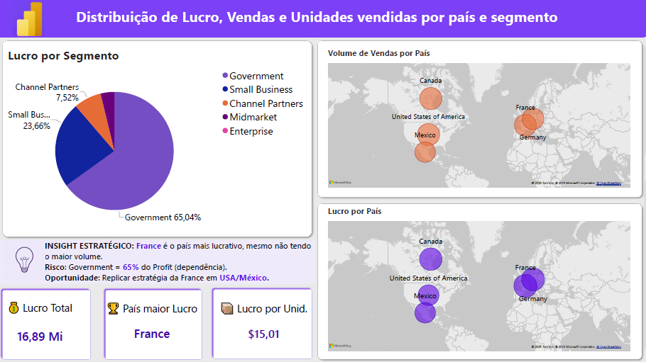

# Dashboard de Vendas - Financials Sample | Power BI

Projeto do Desafio DIO - Análise de vendas, lucro e performance por país e segmento.

O dataset simula uma empresa global de bicicletas com 6 modelos. O foco da análise não é o produto em si, mas a performance de vendas por segmento e país.

## 📊 Visão das Páginas

### Página 1 - Visão de Produtos: O que vende?

Análise de vendas e lucro por produto e segmento.

**Modelos de bicicleta fictícios:**

- Paseo = Bike de passeio - urbana (por isso mais vende)
- VTT = Vélo Tout Terrain - bike de trilha (por isso é a mais cara, ~140)
- Velo = Bike de estrada / velocidade
- Amarilla = Linha esportiva intermediária
- Montana = Mountain bike (subida/trilha)
- Carretera = Bike de estrada

### Página 2 - Visão Temporal: Quando vende?
Evolução de vendas e lucro ao longo do tempo (Mês/Ano).

### Página 3 - Visão Geográfica e Estratégica: Onde lucra?
Lucratividade por país e segmento. France é o país mais lucrativo.

### 💡 Insight Estratégico Página 3:
France é o país mais lucrativo (mesmo sem ter o maior volume de vendas).

- **Risco:** Segmento Government representa 65,04% do lucro total. Alta dependência: se esse segmento cair, a maior parte do lucro vai junto.
- **Oportunidade:** Replicar a estratégia de margem da France nos mercados de USA e México para diversificar a receita.
- **KPIs:** Lucro Total: 16,89 Mi | Top País: France | Lucro por Unid: $15,01

**Ferramentas:** Power BI Desktop, DAX
**Dataset:** https://github.com/julianazanelatto/power_bi_analyst
